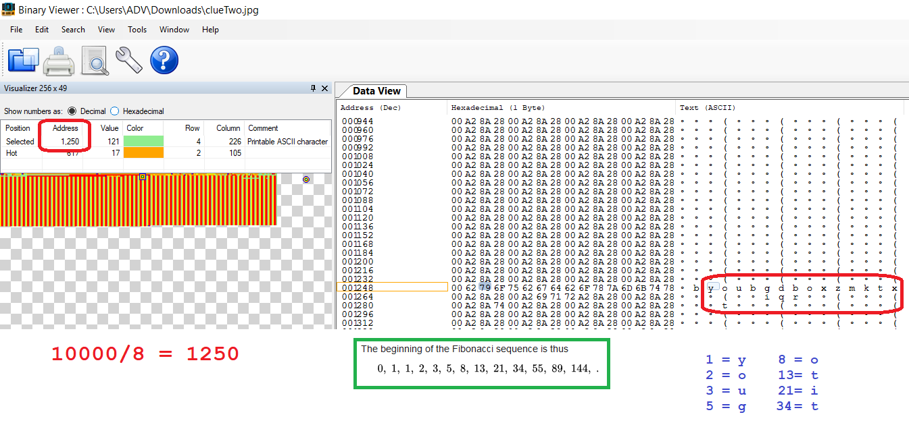
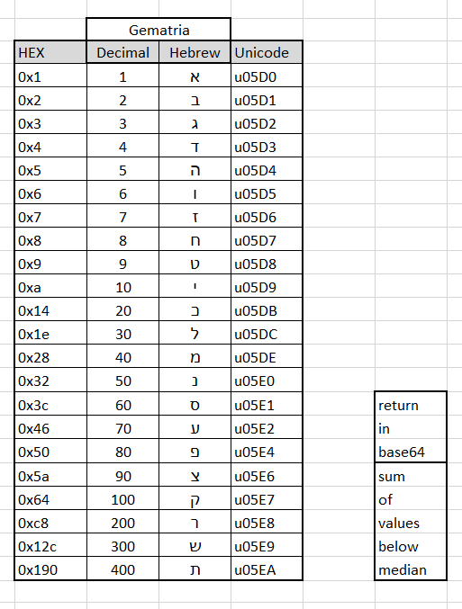

### Shabak Challenge 2018 in Software and Data Science

To get into Challenges Web Page you need to find and enter password: `JOINUS`

Here is my video on how to find it:
https://youtu.be/BqK95ty95ao


## Challenge-1
Use Brute-Force for ZIP file
```
wget http://etgar.eastus.cloudapp.azure.com/software/clues.zip
sudo apt-get install fcrackzip 
fcrackzip -b -c 1 clues.zip        <-------here you get your password, Password is: 262626
unzip clues.zip
```

Python Script need to be fixed:

[--------Start--------------]
```python
from PIL import Image,ImageFont
import textwrap
from pathlib import Path


def find_text_in_image(imgPath):
     image = Image.open(imgPath)
     red_band = image.split()[0]
     xSize = image.size[0]
     ySize = image.size[1]
     newImage = Image.new("RGB", image.size)
     imagePixels = newImage.load()
     for f in range(xSize):
         for j in range(ySize):
               if bin(red_band.getpixel((f, j)))[-1] == '0':
                        imagePixels[f, j] = (255, 255, 255)
               else:
                   imagePixels[f, j] = (0,0,0)
     newImgPath=str(Path(imgPath).parent.absolute())
     newImage.save(newImgPath+'/text.png')
     
find_text_in_image("clue.png")
```
[--------End-------------]

Decypt of file *clue.png* give image with text: 
#### Binary, Start 10,000 place, Fibonacci

This need to be used on Second Image *clueTwo.jpg*, no need to convert it.

10000buts / 8 = 1250 decimal place in file.

Use Binary Viewer on file *clueTwo.jpg* and start reading characters from Address 1250 by Fibonacci sequence.

Fibonacci Sequence: 1,2,3,5,8,13,21,34
```
1=y
2=o
3=u
5=g
8=o
13=t
21=i
34=t
```
`yougotit` add spaces and yo got secret answer `you got it`



Here is my video on how to solve it:
https://youtu.be/m1NY8JyOT_0


## Challenge-2
1. First fix JSON file from `"value": ?` to `"value": "?"`

2. Top Level Keys in JSON are HEX values of Gematria: https://en.wikipedia.org/wiki/Gematria

3. In JSON text you can see a lot of `u05` values, this is Unicode for Hebrew latters: https://en.wikipedia.org/wiki/Unicode_and_HTML_for_the_Hebrew_alphabet


4. Value in JSON is SUM of Decimal values of all Unicodes in this 'text'

5. Count all missed 'Value', which represented by `"Value"= "?"`

6. In JSON you can see few keys which called differenly than TEXT, this is actually two clues :),
if you collect all those words you will get: 
```
return
in
base64
sum
of
values
below
median
```

7. You need to calculate MEDIAN

8. Calculate SUM of all values which are below MEDIAN, you should get `2501577`

9. Encode calculated SUM to base64 value to get Final Password!

10. You are done.

Here is my video on how to solve it:
https://youtu.be/Hqsyi1UkjvA

## Challenge-3

1. Import log.cvs file into any SQL database to simplify data analyzis

2. But before this we need to add into first row few more fields for some junk data

You can edit this file with any editor which can handle 10.000.001 lines.
We need to change just first line

From `uid,uip,date,url` To `uid,uip,date,url,hara1,hara2,hara3,hara4,hara5`

On Linux it's very fast:
```
wget http://etgar.eastus.cloudapp.azure.com/software/TheUsualSuspect.zip
unzip TheUsualSuspect.zip
head log.csv
sed -i "1s/.*/uid,uip,date,url,hara1,hara2,hara3,hara4/" log.csv
head log.csv
wc -l log.csv
```

3. hint.txt contain 'uid' - userID of suspects on which we need to base our search

4. I'am using SQLite Browser to import and run SQL Queries https://sqlitebrowser.org/

*SQL Queries*:

`List number of use per IP per UserId`
```sql
select uid,uip, count(uip)
from 'log-fixed'
where uid ='4918'
group by uip
order by count(uip) desc
```

`List IP addresses and userID with usage number 601`
```sql
select uid, uip, count(uip)
from 'log-fixed'
group by uid,uip
HAVING COUNT(uip) = 601
order by count(uip) desc
```

Most used IP addresses for guys from `hint.txt`
```
UserID	Most used IP	Count of use
2449	104.45.191.227	601
6796	138.27.249.121	601
9237	130.76.88.3	601
4024	230.167.210.226	601
3538	67.141.120.237	601
3608	162.219.33.114	601
7239	143.204.212.207	601
435	68.17.81.83	601
2211	114.79.247.223	601
5206	10.192.20.173	601    <--- Private IP Address
```

Here is my video on how to partialy solve it:
https://youtu.be/XON76wBHpIk
